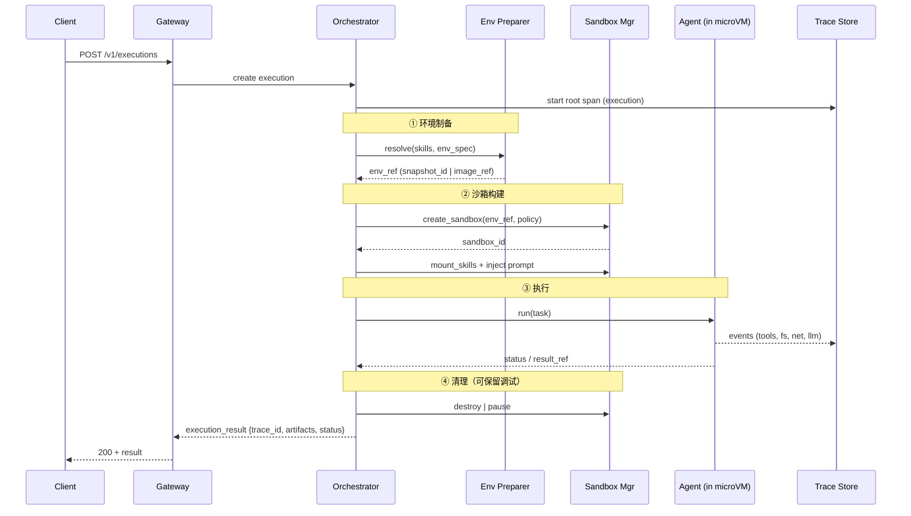

# Skills Runtime 设计草案

## 1. 目标

提供一个 **agent 挂载 skills 执行的沙箱运行时**：

```
请求 → 环境制备 → 沙箱构建 → 执行 → 返回 trace
```

- Skills 以可版本化包（`SKILL.md` + 资源）形式装载进隔离环境
- 沙箱基于 E2B 类 microVM（Firecracker / Cloud Hypervisor）
- Runtime 本身是 **控制面**，不在业务执行路径里跑 agent 逻辑
- Trace 从环境制备阶段即开始录制，落盘在沙箱外

---

## 2. 组件图

```mermaid
flowchart TB
    subgraph Client
        CLI[CLI / SDK]
        API_Caller[API Caller]
    end

    subgraph ControlPlane["Skills Runtime · Control Plane"]
        GW[API Gateway<br/>POST /v1/executions]
        ORCH[Orchestrator<br/>状态机 · 调度 · 超时 · 重试]

        subgraph Prep["环境制备"]
            SKILL_RES[Skill Resolver<br/>版本解析 · 依赖声明]
            ENV_PREP[Environment Preparer<br/>镜像选择 · 快照复用/构建]
        end

        subgraph SandboxLayer["沙箱管理"]
            SB_MGR[Sandbox Manager<br/>microVM 生命周期]
            POLICY[Policy Engine<br/>网络 / FS / 资源配额]
        end

        TRACE[Trace Collector<br/>spans · tool calls · fs · net]
    end

    subgraph DataPlane["数据面 · microVM"]
        AGENT[Agent Executor<br/>LLM loop + tools]
        SKILL_MOUNT["/skills/*<br/>只读挂载"]
        WORKSPACE[/workspace<br/>可写工作区]
    end

    subgraph Storage
        REG[(Skill Registry<br/>包 + 版本 + 元数据)]
        SNAP[(Snapshot Store<br/>环境快照 / 镜像层)]
        TRACE_STORE[(Trace Store)]
        ART[(Artifact Store<br/>输出物)]
    end

    CLI --> GW
    API_Caller --> GW
    GW --> ORCH

    ORCH --> SKILL_RES
    SKILL_RES --> REG
    ORCH --> ENV_PREP
    ENV_PREP --> SNAP

    ORCH --> SB_MGR
    SB_MGR --> POLICY
    SB_MGR -->|start / pause / resume / destroy| DataPlane

    ENV_PREP -->|inject skills| SKILL_MOUNT
    SB_MGR --> AGENT

    AGENT -->|stream events| TRACE
    TRACE --> TRACE_STORE
    AGENT -->|artifacts| ART

    ORCH -.->|span: prepare/build/exec| TRACE
```

### 组件职责

| 组件 | 职责 | 不负责 |
|------|------|--------|
| **API Gateway** | 鉴权、限流、请求校验、同步/异步入口 | 业务编排 |
| **Orchestrator** | 驱动五阶段状态机、超时/重试/取消 | 沙箱内部细节 |
| **Skill Resolver** | 解析 skill@version、依赖图、兼容性检查 | 下载执行 |
| **Environment Preparer** | 选基础镜像、组装 env 层、命中/构建快照 | 起 VM |
| **Sandbox Manager** | microVM 创建/挂起/恢复/销毁、资源挂载 | 环境内容决策 |
| **Policy Engine** | 网络白名单、FS 权限、CPU/内存/磁盘配额 | 执行策略 |
| **Agent Executor** | 数据面 agent 循环（LLM + tool calls） | 记账/调度 |
| **Trace Collector** | 全链路 span、tool/fs/net 事件、结构化日志 | 判定成功失败 |

---

## 3. 执行流水线



### 状态机

```
CREATED
  → RESOLVING_SKILLS
  → PREPARING_ENV
  → BUILDING_SANDBOX
  → MOUNTING_SKILLS
  → EXECUTING
  → COLLECTING_TRACE
  → SUCCEEDED | FAILED | TIMEOUT | CANCELLED
```

---

## 4. 接口草案

### 4.1 控制面 HTTP API

```http
POST /v1/executions
Content-Type: application/json

{
  "skill_refs": [
    { "name": "pdf-official", "version": "1.2.0" },
    { "name": "docx-official", "version": "*" }
  ],
  "task": {
    "prompt": "把 input/report.pdf 转成 docx",
    "inputs": [{ "path": "input/report.pdf", "url": "https://..." }],
    "outputs": [{ "path": "output/report.docx" }]
  },
  "env": {
    "base_image": "python:3.12-slim",
    "packages": ["poppler-utils"],
    "snapshot_policy": "prefer_cache"   // prefer_cache | always_build | pin
  },
  "agent": {
    "model": "anthropic/claude-sonnet-4-5",
    "max_steps": 40,
    "timeout_sec": 600
  },
  "sandbox_policy": {
    "network": { "mode": "allowlist", "hosts": ["api.anthropic.com"] },
    "filesystem": { "readonly": ["/skills"], "writable": ["/workspace"] },
    "resources": { "vcpus": 2, "memory_mb": 2048, "disk_mb": 4096 }
  },
  "trace": {
    "level": "full",          // minimal | standard | full
    "record_fs": true,
    "record_net": true
  },
  "webhook": "https://example.com/hooks/exec"
}
```

```http
# 同步模式（短任务）
200 OK
{
  "execution_id": "exec_01J...",
  "status": "SUCCEEDED",
  "trace_id": "tr_01J...",
  "artifacts": [{ "path": "output/report.docx", "url": "..." }],
  "usage": { "duration_ms": 42310, "llm_tokens": 18233 }
}

# 异步模式
202 Accepted
{ "execution_id": "exec_01J...", "status": "CREATED", "poll_url": "/v1/executions/exec_01J..." }
```

```http
GET  /v1/executions/{id}                 # 状态 + 摘要
GET  /v1/executions/{id}/trace           # 完整 trace（JSONL / OTLP）
GET  /v1/executions/{id}/artifacts       # 输出物列表 + 签名 URL
POST /v1/executions/{id}/cancel
POST /v1/executions/{id}/replay          # 同 env/skills 重跑（调试）

GET  /v1/skills                          # skill 列表
GET  /v1/skills/{name}/versions
POST /v1/skills/{name}/versions          # 发布 skill 包
GET  /v1/snapshots/{id}
```

### 4.2 Skill 包格式

```yaml
# skill.yaml — 注册表元数据
name: pdf-official
version: 1.2.0
description: PDF extract/compose/fill
entry: SKILL.md

requires:
  packages: ["poppler-utils", "python@3.12"]
  bins: ["pdftotext", "ffmpeg"]
  env:
    - name: PDF_OCR
      optional: true

capabilities:            # Policy Engine 依据此收敛权限
  network: ["github.com"]
  filesystem:
    read: ["/workspace"]
    write: ["/workspace/output"]
  tools: ["bash", "python"]

resources:
  memory_mb: 512
  disk_mb: 256

artifacts:
  - path: scripts/**
    mount: /skills/pdf-official/scripts
```

```markdown
<!-- SKILL.md — 注入 agent 的指令体 -->
---
name: pdf-official
---
Use this skill whenever a PDF file is being produced...
```

### 4.3 内部 gRPC / SDK 接口

```protobuf
service SkillsRuntime {
  rpc CreateExecution(ExecutionRequest) returns (Execution);
  rpc StreamExecution(StreamRequest) returns (stream ExecutionEvent);
  rpc CancelExecution(CancelRequest) returns (Execution);
  rpc GetTrace(TraceRequest) returns (stream TraceEvent);
}

service SandboxProvider {          // E2B / 自建 microVM 适配层
  rpc Create(SandboxSpec) returns (SandboxHandle);
  rpc Exec(ExecRequest) returns (stream ExecEvent);
  rpc Snapshot(SnapshotRequest) returns (SnapshotRef);
  rpc Pause(SandboxHandle) returns (Empty);
  rpc Resume(SandboxHandle) returns (Empty);
  rpc Destroy(SandboxHandle) returns (Empty);
}

message SandboxSpec {
  string env_ref = 1;              // image_ref 或 snapshot_id
  Policy policy = 2;
  repeated Mount mounts = 3;       // /skills 只读挂载
  map<string, string> labels = 4;
}
```

### 4.4 Trace Schema（JSONL）

```jsonc
// 每行一个 span / event，execution_id 贯穿全链路
{
  "trace_id": "tr_01J...",
  "span_id": "sp_001",
  "parent_span_id": "sp_000",
  "execution_id": "exec_01J...",
  "stage": "PREPARING_ENV",        // 覆盖 5 阶段，不只 EXECUTING
  "name": "resolve_skills",
  "ts_start": "2026-04-01T10:00:00.000Z",
  "ts_end":   "2026-04-01T10:00:00.120Z",
  "status": "ok",
  "attrs": {
    "skill": "pdf-official@1.2.0",
    "snapshot_hit": true
  }
}

// 工具调用
{
  "type": "tool_call",
  "stage": "EXECUTING",
  "tool": "bash",
  "args_hash": "sha256:...",
  "exit_code": 0,
  "stdout_ref": "blob://tr_01J/sp_014/stdout",
  "duration_ms": 842
}
```

---

## 5. 关键设计决策

| 决策 | 选择 | 理由 |
|------|------|------|
| 环境制备 vs 沙箱构建拆分 | ✅ 拆开 | 环境可缓存/快照复用，隔离边界每次新建 |
| 沙箱技术 | E2B 类 microVM | VM 级隔离、启动快、支持 pause/resume |
| Trace 录制起点 | 环境制备即开始 | 否则 cache miss / 构建失败无审计 |
| Trace 存放 | 沙箱外 Trace Store | 沙箱崩溃不丢证据 |
| Skill 挂载 | `/skills` 只读 | 防 skill 自我篡改；可写仅 `/workspace` |
| 同步 + 异步双模式 | ✅ | 短任务同步返回，长任务 webhook + poll |
| **快照粒度** | **镜像层** `hash(base_image + packages + skills)` | 层缓存命中率高、重建成本可预期 |
| **Agent Executor** | **固化进镜像**，薄自建循环 + model SDK | capability 必须在 tool 层强制；全量 CLI agent 的 trace/挂载不可控 |
| **多 skill capability** | **取交集**（只收窄不放宽） | 多 skill 同挂时权限最小化 |
| Agent 框架 | 自建薄执行器，不嵌 Claude Code/Codex | 同上；工具层自持才能做 capability gate |

## 6. 开放问题

1. **Trace 采样**：`full` 级别是否默认保留 stdout/stdin 全文（隐私 + 存储成本）？
2. **E2B 自托管 vs 云服务**：影响 snapshot 存储和调度器实现方式。
3. **Agent 工具集范围**：首发 bash / python / fs 读写是否够用，何时加 browser / web fetch。
4. **失败重放**：`replay` 是复用同一 env_ref 严格重放，还是允许新模型调用（仅环境固定）。
